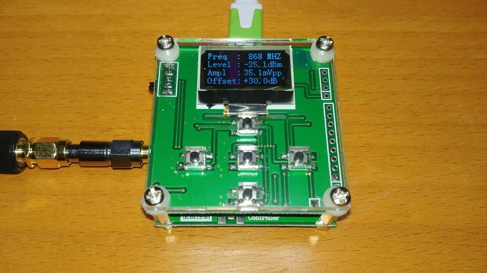
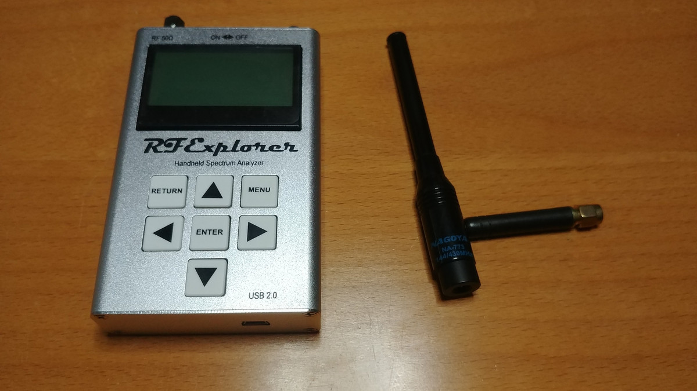
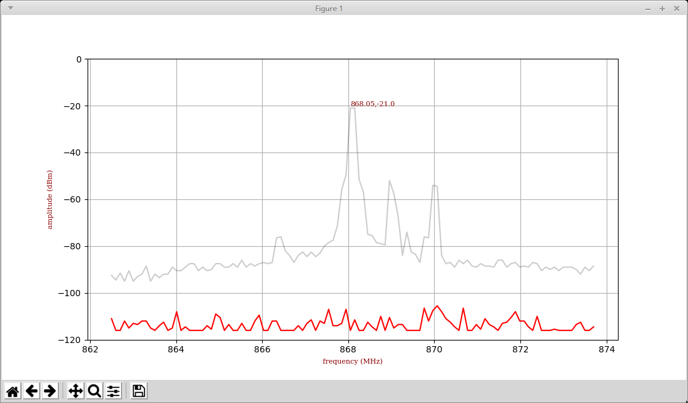

# RF tools utils

This repository is a script toolbox to interact with RF tools like the RF Power Monitor 8000 or the RF Explorer.

## Installation

The scripts in the repo use python 3.X and are meant to be used from a Linux machine. The best way to set up the work environment is using virtualenv. You will also need python-tk.

```
sudo apt-get install python-tk
sudo pip install virtualenv
```

Then prepare your workspace:

```
git clone https://github.com/xoseperez/rf-tools
cd rf-tools
virtualenv --python=python3.5 .env
. ./.env/bin/activate
pip install -r requirements.txt
```

And you are ready to go...

## Tools

### Power Monitor 8000

The Power Monitor 8000 is an RF power monitor with a wide range (up to 8GHz) and impressive quality for it's price. You can read more about it in my post about <a href="https://tinkerman.cat/rf-power-monitoring-tools-on-the-cheap/">RF power monitor tools on the cheap</a>.



The `pm8000.py` script reads the data from the Power Monitor 8000 via USB port and dumps it in a CSV like style with a timestamp and the amplitude of the signal. You can set the center frequency (integer, MHz) and offset (float, dB) form the command line.

```
$ python pm8000.py -f 169 -o -20.0
timestamp,amplitude
...
002257,-72.4
002383,-72.4
002509,-72.4
002635,-72.4
002760,-72.4
002886,-72.5
003012,-72.4
003138,-72.4
003264,-72.5
003389,-21.8
003515,-72.4
003641,-72.4
...
```

### RF Explorer



The `rfexplorer.py` script allows you to get data from you RF Explorer Handheld Spectrum Analyzer in different ways. The first thing you can do is to get the help from the device:

```
$ python rfexplorer.py -h
usage: rfexplorer.py [-h] [-m {peak,swipe,plot}] [-r] [-c FREQ_CENTER]
                     [-s FREQ_SPAN] [-d DURATION] [-p PORT]

optional arguments:
  -h, --help            show this help message and exit
  -m {peak,swipe,plot}  output mode
  -r                    reset RF Explorer
  -c FREQ_CENTER        frequency center
  -s FREQ_SPAN          frequency span
  -d DURATION           monitor for these many seconds
  -p PORT               USB port to use, otherwise will try to find it

Usage examples:

Monitor and print peaks from 862.5 to 873.7 for 60 seconds
    python rfexplorer.py -c 868.1 -s 11.2 -t 60

Plot range of frequencies in real time
    python rfexplorer.py -m plot

(c) 2019-2021 Xose Pérez (@xoseperez)
```

The three different modes have different outputs. The `peak` mode is the default one and it's equivalent to the one in the pm8000 script above:

```
$ python rfexplorer.py 
Detected COM ports:
  * /dev/ttyS4
  * /dev/ttyUSB0
/dev/ttyS4 is a valid available port.
/dev/ttyUSB0 is a valid available port.
RF Explorer Valid Ports found: 2 - /dev/ttyS4 /dev/ttyUSB0 
User COM port: /dev/ttyUSB0
Connected: /dev/ttyUSB0, 500000 bauds
RF Explorer 01.28 05-Apr-19 01.04.05
Received RF Explorer device model info:#C2-M:003,005,01.28
#QA:0
New Freq range - buffer cleared.
Frequency center: 868.1MHz start: 862.5MHz stop: 873.7MHz span: 11.2MHz
timestamp,frequency,amplitude
Device serial number: B3A4EML7353958JE
New Freq range - buffer cleared.
001318,869.97,-104.0
001402,869.97,-104.5
001484,869.56,-104.0
001626,865.93,-104.5
001718,869.97,-102.0
001840,869.76,-106.0
001957,866.94,-100.5
002079,869.97,-101.0
002196,868.55,-104.0
002298,868.76,-104.0
002415,869.97,-103.0
002533,869.97,-103.0
002655,869.97,-103.0
002772,869.97,-103.0
```

The `swipe` mode will output full range data for the scanned frequencies as a CSV file too:

```
$ python rfexplorer.py -m swipe
Detected COM ports:
  * /dev/ttyS4
  * /dev/ttyUSB0
/dev/ttyS4 is a valid available port.
/dev/ttyUSB0 is a valid available port.
RF Explorer Valid Ports found: 2 - /dev/ttyS4 /dev/ttyUSB0 
User COM port: /dev/ttyUSB0
Connected: /dev/ttyUSB0, 500000 bauds
RF Explorer 01.28 05-Apr-19 01.04.05
Received RF Explorer device model info:#C2-M:003,005,01.28
#QA:0
New Freq range - buffer cleared.
Frequency center: 868.1MHz start: 862.5MHz stop: 873.7MHz span: 11.2MHz
Device serial number: B3A4EML7353958JE
timestamp,862.50,862.60,862.70,862.80,862.90,863.00,863.11,863.21,863.31,863.41,863.51,863.61,863.71,863.81,863.91,864.01,864.11,864.22,864.32,864.42,864.52,864.62,864.72,864.82,864.92,865.02,865.12,865.22,865.33,865.43,865.53,865.63,865.73,865.83,865.93,866.03,866.13,866.23,866.33,866.44,866.54,866.64,866.74,866.84,866.94,867.04,867.14,867.24,867.34,867.44,867.54,867.65,867.75,867.85,867.95,868.05,868.15,868.25,868.35,868.45,868.55,868.65,868.76,868.86,868.96,869.06,869.16,869.26,869.36,869.46,869.56,869.66,869.76,869.87,869.97,870.07,870.17,870.27,870.37,870.47,870.57,870.67,870.77,870.87,870.98,871.08,871.18,871.28,871.38,871.48,871.58,871.68,871.78,871.88,871.98,872.09,872.19,872.29,872.39,872.49,872.59,872.69,872.79,872.89,872.99,873.09,873.20,873.30,873.40,873.50,873.60,873.70
000000,-116.0,-116.0,-109.0,-115.5,-116.0,-113.0,-114.5,-109.0,-113.0,-116.0,-115.0,-116.0,-110.5,-116.0,-110.5,-112.5,-116.0,-113.5,-114.0,-116.0,-116.0,-112.0,-116.0,-114.0,-116.0,-113.0,-111.5,-112.5,-113.5,-111.0,-113.5,-116.0,-113.5,-116.0,-111.0,-112.5,-111.0,-113.0,-113.5,-115.0,-115.0,-116.0,-116.0,-109.0,-115.5,-115.0,-116.0,-112.5,-110.5,-115.0,-113.0,-107.0,-116.0,-113.5,-116.0,-116.0,-113.5,-109.5,-116.0,-116.0,-115.0,-116.0,-116.0,-116.0,-114.0,-115.0,-112.5,-116.0,-113.0,-116.0,-116.0,-116.0,-112.0,-113.5,-105.0,-108.5,-116.0,-107.0,-112.5,-112.5,-106.0,-116.0,-110.0,-116.0,-116.0,-116.0,-113.5,-116.0,-111.0,-115.0,-116.0,-115.0,-116.0,-116.0,-114.0,-112.0,-113.5,-107.5,-115.5,-116.0,-113.0,-115.5,-114.5,-113.0,-113.0,-116.0,-113.0,-116.0,-113.0,-114.5,-114.5,-116.0
```

Finally the `plot` mode mimics the screen of the RF Explorer in your computer:

```
$ python rfexplorer.py -m plot
Detected COM ports:
  * /dev/ttyS4
  * /dev/ttyUSB0
/dev/ttyS4 is a valid available port.
/dev/ttyUSB0 is a valid available port.
RF Explorer Valid Ports found: 2 - /dev/ttyS4 /dev/ttyUSB0 
User COM port: /dev/ttyUSB0
Connected: /dev/ttyUSB0, 500000 bauds
RF Explorer 01.28 05-Apr-19 01.04.05
Received RF Explorer device model info:#C2-M:003,005,01.28
#QA:0
New Freq range - buffer cleared.
Frequency center: 868.1MHz start: 862.5MHz stop: 873.7MHz span: 11.2MHz
Device serial number: B3A4EML7353958JE
```



## License

Copyright (C) 2019-2021 by Xose Pérez (@xoseperez)

This program is free software: you can redistribute it and/or modify
it under the terms of the GNU General Public License as published by
the Free Software Foundation, either version 3 of the License, or
(at your option) any later version.

This program is distributed in the hope that it will be useful,
but WITHOUT ANY WARRANTY; without even the implied warranty of
MERCHANTABILITY or FITNESS FOR A PARTICULAR PURPOSE.  See the
GNU General Public License for more details.

You should have received a copy of the GNU General Public License
along with this program.  If not, see <http://www.gnu.org/licenses/>.
